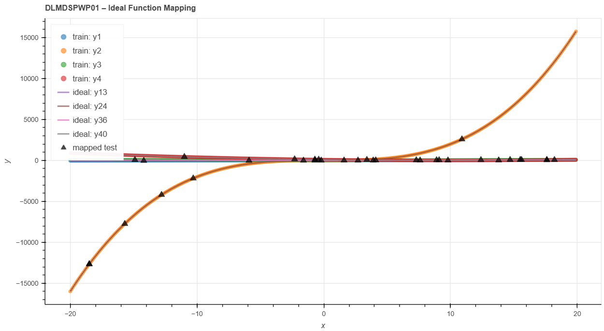

# DLMDSPWP01 – Regression Analysis and Ideal Function Mapping

## Overview

This project implements an object-oriented Python solution for selecting ideal functions using the least-squares method, mapping test data according to the √2 deviation rule, storing results in an SQLite database, and generating interactive visualizations using Bokeh.

## Technologies

* Python 3
* Pandas
* NumPy
* SQLAlchemy
* SQLite
* Bokeh
* PyTest

## Project Structure

```text
DLMDSPWP01/
│
├── data/
│   ├── train.csv
│   ├── ideal.csv
│   ├── test.csv
│   ├── regression_results.db
│   └── regression_plot.html
│
├── src/
│   ├── datasets.py
│   ├── modeling.py
│   ├── db.py
│   ├── viz.py
│   ├── exceptions.py
│   └── main.py
│
├── tests/
│   ├── conftest.py
│   └── test_regression.py
│
├── requirements.txt
├── pytest.ini
├── .gitignore
└── README.md
```

## Installation

```bash
pip install -r requirements.txt
```

## Run the Project

```bash
python src/main.py
```

## Run Unit Tests

```bash
pytest tests/test_regression.py -v

```
## Results
## Visualization



The application successfully:

- Loads and validates all datasets
- Selects the best four ideal functions using least-squares
- Maps test points using the √2 deviation rule
- Stores results in SQLite
- Generates an interactive Bokeh visualization
- Passes all unit tests

## Workflow

1. Load training, ideal and test datasets.
2. Validate dataset structure.
3. Select four ideal functions using least-squares.
4. Map test points using the √2 threshold.
5. Store results in SQLite.
6. Generate interactive visualization.
7. Execute unit tests.

## Author

Divyashree Nagaraj
M.Sc. Artificial Intelligence
IU International University of Applied Sciences
